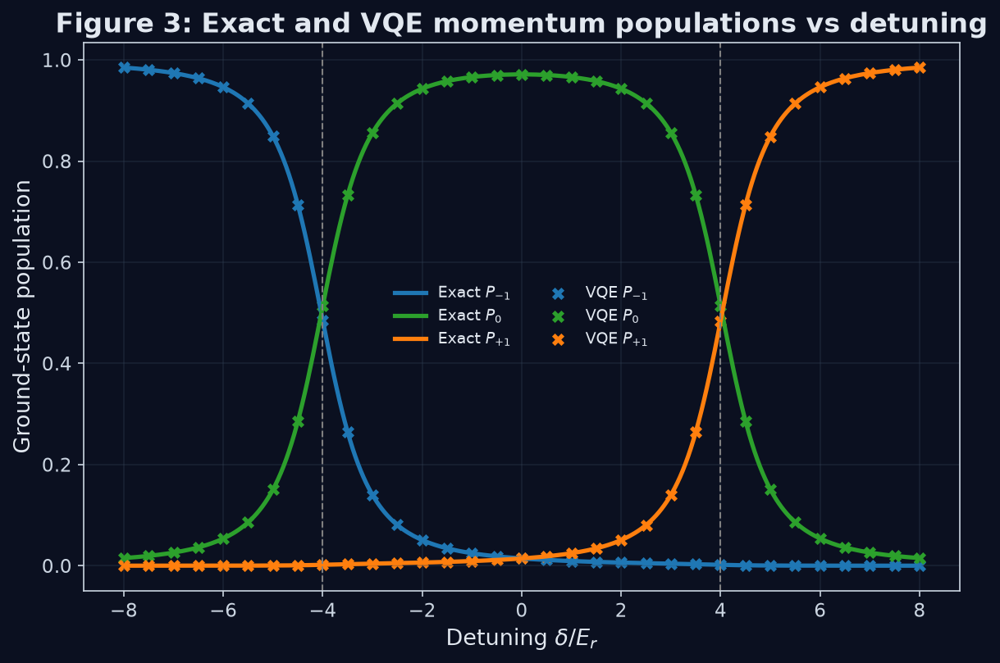

# Bragg VQE

A small, self-contained quantum simulation of Bragg diffraction in a Bose–Einstein condensate,
using a truncated 3-state momentum-space model and the Variational Quantum Eigensolver (VQE).

## Example output



*VQE ground-state momentum populations (markers) tracking the exact solution (lines) across the
full detuning sweep, including through both avoided crossings.*

## Setup

```bash
pip install -r bragg-vqe/requirements.txt
jupyter lab bragg-vqe/notebooks
```

Run the notebooks in order — `01_exact_model` → `02_encoding_and_pauli_form` →
`03_vqe_single_point` → `04_detuning_sweep` — each writes into `bragg-vqe/results/` and
`bragg-vqe/figures/`.

## Aims

* Derive a physically meaningful 3-state Bragg Hamiltonian in momentum space.
* Benchmark it exactly on a classical computer (eigenvalues, ground-state populations, avoided
  crossings).
* Encode the Hamiltonian onto 2 qubits and verify the encoding reproduces the exact physics.
* Decompose the encoded Hamiltonian into Pauli strings for use as a VQE operator.
* Run VQE with a noise-free statevector estimator and benchmark it against the exact solution.
* Sweep VQE across detuning, warm-starting each point from the previous optimum, and compare
  against the exact model throughout.

## Outputs

Running the notebooks in `bragg-vqe/notebooks/` in order (01 → 04) produces:

**Figures** (`bragg-vqe/figures/`)
1. `fig1_exact_eigenspectrum.png` — exact eigenspectrum vs detuning $\delta$
2. `fig2_exact_vqe_energy.png` — exact and VQE ground-state energies vs $\delta$
3. `fig3_exact_vqe_populations.png` — exact and VQE momentum populations vs $\delta$
4. `fig4_min_gap_vs_omega.png` — minimum avoided-crossing gap vs $\Omega$
5. `fig5_momentum_wavefunctions.png` — VQE momentum-space probability density at
   $\delta = -4, 0, 4$
6. `ansatz_circuit.png` — the two-qubit VQE ansatz circuit diagram

**Data** (`bragg-vqe/results/`)
* `vqe_detuning_sweep.csv` — per-detuning exact/VQE energies, energy error, fidelity, momentum
  populations, and leakage into the unphysical $|11\rangle$ state

**Tables** (printed in `04_detuning_sweep.ipynb` and `03_vqe_single_point.ipynb`)
* energy/fidelity comparison table (exact vs VQE at sample detunings)
* optimizer comparison table (COBYLA, Nelder-Mead, L-BFGS-B, SPSA)

**Verified derivations** (`02_encoding_and_pauli_form.ipynb`)
* the 2-qubit encoding matches the exact 3-state spectrum
* the Pauli decomposition matches the encoded Hamiltonian matrix exactly

## Project structure

```
bragg-vqe/
├── notebooks/
│   ├── 01_exact_model.ipynb
│   ├── 02_encoding_and_pauli_form.ipynb
│   ├── 03_vqe_single_point.ipynb
│   └── 04_detuning_sweep.ipynb
├── src/
│   ├── hamiltonian.py
│   ├── encoding.py
│   ├── exact_solver.py
│   └── vqe_solver.py
├── results/
└── figures/
```

`src/` holds the reusable physics and VQE code; the notebooks import from it and add the
exploratory/plotting layer on top.

## Theory

### Derivation of the 3-state Bragg Hamiltonian

#### 1. Start from the lab-frame Schrödinger equation

We begin with the single-particle Hamiltonian

```math
H(t)=\frac{\hat p^2}{2m}+V_0\cos(2k_Lx-\delta t),
```

so the Schrödinger equation is

```math
i\hbar \frac{\partial}{\partial t}\psi(x,t)
=
\left(
\frac{\hat p^2}{2m}+V_0\cos(2k_Lx-\delta t)
\right)\psi(x,t).
```

We expand the wavefunction in plane-wave momentum orders:

```math
\psi(x,t)=\sum_{n=-\infty}^{\infty} c_n(t)e^{i2nk_Lx}.
```

The basis state $e^{i2nk_Lx}$ corresponds to momentum

```math
p_n=2n\hbar k_L.
```

#### 2. Time derivative term

Differentiate the expansion with respect to time:

```math
\frac{\partial}{\partial t}\psi(x,t)
=\sum_n \dot c_n(t)e^{i2nk_Lx}.
```

So the left-hand side becomes

```math
i\hbar\frac{\partial}{\partial t}\psi(x,t)
=\sum_n i\hbar \dot c_n(t)e^{i2nk_Lx}.
```

#### 3. Kinetic-energy term

The momentum operator is

```math
\hat p=-i\hbar\frac{\partial}{\partial x}.
```

Acting on one basis function,

```math
\hat p\,e^{i2nk_Lx}
=-i\hbar\frac{\partial}{\partial x}e^{i2nk_Lx}
=2n\hbar k_L\,e^{i2nk_Lx}.
```

Applying $\hat p$ again gives

```math
\hat p^2 e^{i2nk_Lx}=(2n\hbar k_L)^2 e^{i2nk_Lx}.
```

Hence

```math
\frac{\hat p^2}{2m}e^{i2nk_Lx}
=\frac{(2n\hbar k_L)^2}{2m}e^{i2nk_Lx}.
```

Define the recoil energy

```math
E_r=\frac{\hbar^2k_L^2}{2m}.
```

Then

```math
\frac{(2n\hbar k_L)^2}{2m}=4n^2E_r,
```

so

```math
\frac{\hat p^2}{2m}e^{i2nk_Lx}=4n^2E_r\,e^{i2nk_Lx}.
```

Therefore,

```math
\frac{\hat p^2}{2m}\psi(x,t)
=\sum_n 4n^2E_r\,c_n(t)e^{i2nk_Lx}.
```

#### 4. Potential term

Write the cosine as exponentials:

```math
\cos(2k_Lx-\delta t)
=\frac12\left(e^{i(2k_Lx-\delta t)}+e^{-i(2k_Lx-\delta t)}\right).
```

So

```math
V_0\cos(2k_Lx-\delta t)
=\frac{V_0}{2}e^{i2k_Lx}e^{-i\delta t}
+\frac{V_0}{2}e^{-i2k_Lx}e^{i\delta t}.
```

Multiplying by the wavefunction gives

```math
V_0\cos(2k_Lx-\delta t)\psi(x,t)
=
\frac{V_0}{2}e^{i2k_Lx}e^{-i\delta t}\sum_n c_n e^{i2nk_Lx}
+
\frac{V_0}{2}e^{-i2k_Lx}e^{i\delta t}\sum_n c_n e^{i2nk_Lx}.
```

Distribute the exponentials:

```math
=
\frac{V_0}{2}\sum_n c_n e^{-i\delta t} e^{i2(n+1)k_Lx}
+
\frac{V_0}{2}\sum_n c_n e^{i\delta t} e^{i2(n-1)k_Lx}.
```

Now relabel the summation indices so both sums are written in terms of $e^{i2nk_Lx}$.

For the first sum, let $n\to n-1$:

```math
\frac{V_0}{2}\sum_n e^{-i\delta t} c_{n-1} e^{i2nk_Lx}.
```

For the second sum, let $n\to n+1$:

```math
\frac{V_0}{2}\sum_n e^{i\delta t} c_{n+1} e^{i2nk_Lx}.
```

So the potential term becomes

```math
V_0\cos(2k_Lx-\delta t)\psi(x,t)
=
\sum_n \frac{V_0}{2}\left(e^{-i\delta t}c_{n-1}(t)+e^{i\delta t}c_{n+1}(t)\right)e^{i2nk_Lx}.
```

#### 5. Equate coefficients of each plane wave

The Schrödinger equation now reads

```math
\sum_n i\hbar \dot c_n e^{i2nk_Lx}
=
\sum_n 4n^2E_r c_n e^{i2nk_Lx}
+
\sum_n \frac{V_0}{2}\left(e^{-i\delta t}c_{n-1}+e^{i\delta t}c_{n+1}\right)e^{i2nk_Lx}.
```

Since the plane waves $e^{i2nk_Lx}$ are linearly independent, the coefficients must match for each $n$:

```math
i\hbar \dot c_n(t)
=4n^2E_r\,c_n(t)
+\frac{V_0}{2}\left(e^{-i\delta t}c_{n-1}(t)+e^{i\delta t}c_{n+1}(t)\right).
```

This is the lab-frame coupled-mode equation.

#### 6. Rotating-frame transformation

Define new amplitudes $b_n(t)$ by

```math
c_n(t)=b_n(t)e^{-in\delta t}.
```

This removes the explicit time dependence from the couplings.

Differentiate:

```math
\dot c_n(t)
=\dot b_n(t)e^{-in\delta t}-in\delta\,b_n(t)e^{-in\delta t}.
```

Multiply by $i\hbar$:

```math
i\hbar\dot c_n(t)
=i\hbar\dot b_n(t)e^{-in\delta t}
+\hbar n\delta\,b_n(t)e^{-in\delta t}.
```

Substitute into the lab-frame equation:

```math
i\hbar\dot b_n e^{-in\delta t}
+\hbar n\delta\,b_n e^{-in\delta t}
=4n^2E_r\,b_n e^{-in\delta t}
+\frac{V_0}{2}\left(e^{-i\delta t}b_{n-1}e^{-i(n-1)\delta t}+e^{i\delta t}b_{n+1}e^{-i(n+1)\delta t}\right).
```

Simplify the phases:

```math
e^{-i\delta t}e^{-i(n-1)\delta t}=e^{-in\delta t},
```

```math
e^{i\delta t}e^{-i(n+1)\delta t}=e^{-in\delta t}.
```

So the equation becomes

```math
i\hbar\dot b_n e^{-in\delta t}
+\hbar n\delta\,b_n e^{-in\delta t}
=4n^2E_r\,b_n e^{-in\delta t}
+\frac{V_0}{2}(b_{n-1}+b_{n+1})e^{-in\delta t}.
```

Divide through by $e^{-in\delta t}$:

```math
i\hbar\dot b_n
+\hbar n\delta\,b_n
=4n^2E_r\,b_n
+\frac{V_0}{2}(b_{n-1}+b_{n+1}).
```

Rearrange:

```math
i\hbar\dot b_n
=\left(4n^2E_r-\hbar n\delta\right)b_n
+\frac{V_0}{2}(b_{n-1}+b_{n+1}).
```

#### 7. Rotating-frame Hamiltonian

Therefore, the effective Hamiltonian in the momentum basis is

```math
H_{\text{rot}}
=\sum_n \left(4n^2E_r-\hbar n\delta\right)|n\rangle\langle n|
+\frac{V_0}{2}\sum_n\left(|n\rangle\langle n+1|+|n+1\rangle\langle n|\right).
```

This is the infinite momentum ladder.

#### 8. Three-state truncation

Keep only

```math
n=-1,0,+1.
```

The basis is

```math
\{|{-1}\rangle,|0\rangle,|{+1}\rangle\}.
```

The diagonal energies are:

- for $n=-1$: $4E_r+\hbar\delta$
- for $n=0$: $0$
- for $n=+1$: $4E_r-\hbar\delta$

The couplings are:

- $|{-1}\rangle \leftrightarrow |0\rangle$ with strength $V_0/2$,
- $|0\rangle \leftrightarrow |{+1}\rangle$ with strength $V_0/2$,
- no direct $|{-1}\rangle \leftrightarrow |{+1}\rangle$ coupling.

So the three-state Hamiltonian is

```math
H_3
=\begin{pmatrix}
4E_r+\hbar\delta & \frac{V_0}{2} & 0\\
\frac{V_0}{2} & 0 & \frac{V_0}{2}\\
0 & \frac{V_0}{2} & 4E_r-\hbar\delta
\end{pmatrix}.
```

In the dimensionless units used in the code,

```math
E_r=\hbar=1,
\qquad
\Omega=\frac{V_0}{2},
```

so this becomes

```math
H_3
=\begin{pmatrix}
4+\delta & \Omega & 0\\
\Omega & 0 & \Omega\\
0 & \Omega & 4-\delta
\end{pmatrix}.
```

#### 9. Physical interpretation

- The diagonal terms $4n^2E_r-\hbar n\delta$ are the effective rotating-frame energies of the momentum orders.
- The off-diagonal terms $\Omega$ couple neighbouring momentum states through Bragg scattering.
- The three-state truncation is valid when higher momentum orders are energetically suppressed.
- The avoided crossings appear when one of the moving momentum states becomes resonant with the zero-momentum state.

### Avoided crossings and the $2\Omega$ gap

An avoided crossing is what happens when two energy levels *would* cross as a parameter is swept,
but a coupling between the underlying states mixes them instead — the true eigenvalues bend away
from each other and never actually touch. In Figure 1, this is visible as the two lowest bands
curving apart near $\delta=\pm4$ rather than passing straight through one another.

Near $\delta=+4$, the $|0\rangle$ state (diagonal energy $0$) and the $|{+1}\rangle$ state
(diagonal energy $4-\delta$) become nearly degenerate, while $|{-1}\rangle$ is far detuned and can
be dropped. That leaves an effective two-level Hamiltonian in the $\{|0\rangle,|{+1}\rangle\}$
subspace:

```math
H_{\text{eff}}=\begin{pmatrix}0 & \Omega\\ \Omega & 4-\delta\end{pmatrix}.
```

For a general two-level Hamiltonian

```math
\begin{pmatrix}a & \Omega\\ \Omega & b\end{pmatrix},
```

the eigenvalues are

```math
E_{\pm}=\frac{a+b}{2}\pm\sqrt{\left(\frac{a-b}{2}\right)^2+\Omega^2},
```

so the gap between the two branches is

```math
\Delta E=E_+-E_-=2\sqrt{\left(\frac{a-b}{2}\right)^2+\Omega^2}.
```

Here $a=0$ and $b=4-\delta$, so $(a-b)/2=(\delta-4)/2$, which vanishes exactly at resonance,
$\delta=4$. At that point the gap collapses to its minimum value:

```math
\Delta E_{\min}=2\Omega.
```

Away from resonance the $(\delta-4)^2$ term grows again and the gap widens — that's the "avoided"
shape of the crossing. This is exactly the relationship checked numerically in Figure 4: the
minimum gap found by direct diagonalization matches the analytic $2\Omega$ line across every
coupling strength swept.
